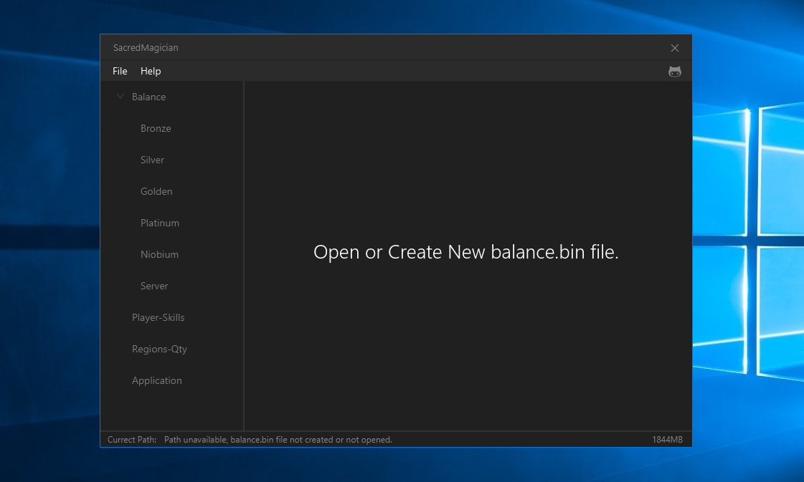

# SacredMagician
A powerful balance.bin editor for Sacred and Sacred Underworld, on Kotlin JVM.

# Requirements

 * JRE minimum version for .jar variant (1.8.0), for .exe (1.8.0_121).
 * Administrator rules if application pasted in UAC secure folders.

# Features

 * IS! OpenSource Project! No privacy, and it opportunity to improve!
 * Writed on simple, beautiful and cool language "Kotlin" under JVM.
 * Constant support and updates, bug fixes, help with editing balance files.
 * Ability to creating \ generating balance files, without problems!
 * Restricted not-needed keys, allowed only numbers and "."!
 * Data length control, and safe saving data pasted in textfields!
 * International English we all love! Say "Hello" to all people! 
 * Compatible from Sacred 1.0 to Sacred 2.29.14 (Modifications not supported).
 
# Downloads

 * Download the source and run the SacredMagician (compiling source requires IntelliJ IDEA 2018.2+ and Java8+ and Kotlin 1.3).
 * Download a pre-compiled SacredMagician from the [releases](https://github.com/MairwunNx/SacredMagician/releases) page.
 * Download latest version from google drive [Release](https://drive.google.com/file/d/13t88XU7uT0DtrtSqVpaB8eRtu2cSebtx/view) type or [Alpha](https://drive.google.com/file/d/1tj-C7svsMs6qlzWrvfEzKtHfOrpwfXm3/view) type.
  
# Change Log

 * See SacredMagician change log [here](https://github.com/MairwunNx/SacredMagician/blob/master/CHANGELOG.md) (latest version above change log page).

# Want to say thanks?

 * Hit the star button or say thanks message to MairwunNx@gmail.com .
 * May be... Donate please :) [QIWI](https://qiwi.me/mairwunnx) or [Yandex.Money](https://money.yandex.ru/to/410015993365458)..
 
# Special thanks

 * Special thanks to Sha**no*us for testing for errors and bugs and design work test!
 * Special thanks to @andreyazimoov for testing and finding some bugs!
 * Special thanks to JetBrains for the free student license! Use this wonderful product!

# Recommend to use
 
 * Great [JMetro](https://github.com/JFXtras/jfxtras-styles) css styles based on Fluent Design Language and Metro!
 * Great kotlin ui JavaFX Framework library [TornadoFx](https://github.com/edvin/tornadofx)!

# In future

 * All tasks for the future are made! If you have idea, open Issue or send it on email me.

## Thanks for using SacredMagician! Maded with ❤, please click on ★!